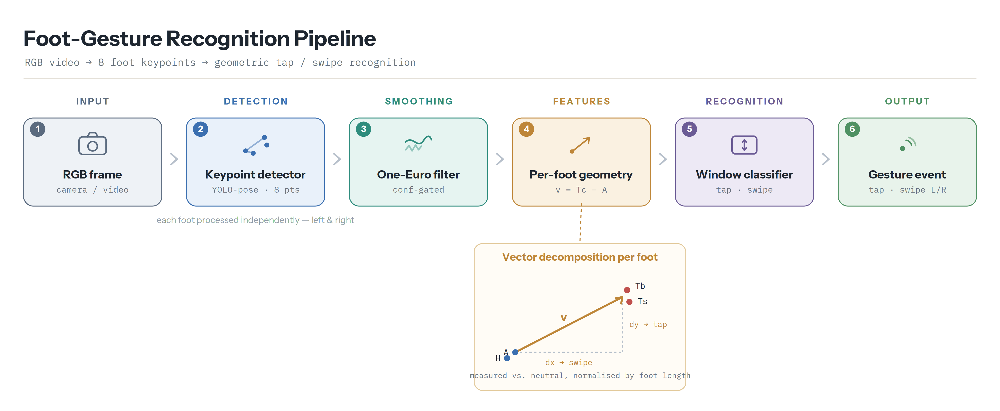

# Foot-Gesture Recognition from RGB Video

A lightweight, interpretable pipeline for recognizing **tap** and **swipe** foot
gestures from ordinary RGB video, using a **foot-only** keypoint detector instead
of full-body pose estimation. It is designed for hands-free interaction in
settings where only the lower limbs or feet are visible (floor-level cameras,
seated interaction, assistive or industrial interfaces).

The system estimates eight local foot landmarks with a custom YOLO-pose detector,
smooths them with a confidence-gated One-Euro filter, and classifies short
temporal windows with a simple geometric rule set. No wearable sensors, no
full-body visibility, no learned temporal model.

---

## Pipeline overview



```
RGB frame ─► Foot keypoint detector ─► One-Euro smoothing ─► Per-foot geometry ─► Window classifier ─► Gesture event
            (YOLO-pose, 8 landmarks)   (confidence-gated)     (v = Tc − A)          (tap / swipe L/R)
```

1. **Detection.** A custom YOLO-pose model localizes 8 foot keypoints (big toe,
   small toe, heel, ankle — per foot). When several detections appear, the
   instance with the highest mean keypoint confidence is used.
2. **Smoothing.** Each keypoint is filtered with the One-Euro filter; low-
   confidence points are gated out and brief dropouts are held for up to 3 frames.
3. **Geometry.** Per foot, the ankle→toe-center vector `v = Tc − A` is computed
   and referenced to a calibrated neutral pose, normalized by foot length.
4. **Classification.** Over a fixed 30-frame window, the horizontal component of
   `v` drives **swipe** detection and the vertical component drives **tap**
   detection. Gestures are edge-triggered (fire once, re-arm at neutral).

> The keypoint mapping (indices 0–7): `left_big_toe, left_small_toe, left_heel,
> left_ankle, right_big_toe, right_small_toe, right_heel, right_ankle`.

---

## Gesture vocabulary

| Gesture        | Signal                                             |
|----------------|----------------------------------------------------|
| `tap`          | Vertical toe motion relative to the ankle          |
| `swipe_left`   | Horizontal toe motion (toe pivots one way)         |
| `swipe_right`  | Horizontal toe motion (toe pivots the other way)   |
| `none` (idle)  | No gesture — used to measure false activations     |

Translation ("move") gestures are supported by the generator and recognizer but
were **excluded** from the final vocabulary: forward/backward foot translation is
strongly foreshortened on a front-facing camera and not reliably separable. See
[Limitations](#limitations).

---

## Repository structure

```
.
├── README.md
├── requirements.txt
├── gestures.py                # geometric gesture recognizer (the classifier)
├── euro_smoothing.py          # confidence-gated One-Euro keypoint smoother
├── live_demo.py               # live / video demo with an on-screen HUD
├── evaluate.py                # evaluation harness (macro-F1, false-fire, sweeps)
├── generate_gestures.py       # Blender synthetic-clip generator
├── filter_analysis.py         # filter jitter table + raw-vs-filtered figure
├── benchmark.py               # end-to-end runtime benchmark
├── detector_comparison.py     # MediaPipe / RTMPose / ours comparison grid
├── mediapipe_check.py         # standalone MediaPipe sanity check
├── docs/
│   └── system_overview.png    # pipeline diagram
└── weights/
    └── best.pt                # trained foot-keypoint detector
```

> **Module naming:** `live_demo.py` and `evaluate.py` import the recognizer as
> `gestures`. If your file is named `foot_gestures.py`, either rename it to
> `gestures.py` or keep both identical — `evaluate.py` falls back to
> `foot_gestures` and prints which module it loaded.

---

## Installation

```bash
python -m venv venv && source venv/bin/activate
pip install -r requirements.txt
```

Core requirements: `numpy`, `opencv-python`, `ultralytics` (detector + smoother +
recognizer + live demo). Additional tools:

- **Evaluation** (`evaluate.py`): `scikit-learn`
- **Filter figure** (`filter_analysis.py`): `matplotlib`
- **Detector comparison** (`detector_comparison.py`): `Pillow`, plus the
  detectors you want to compare:
  - MediaPipe: `pip install "mediapipe>=0.10.14"` and a `pose_landmarker.task`
    model file (Tasks API). On headless Linux you may also need GL libraries
    (`libgles2`, `libegl1`) for the runtime.
  - RTMPose: `pip install rtmlib onnxruntime` (or `onnxruntime-gpu`).
- **Synthetic data** (`generate_gestures.py`): **Blender 5.x** (run via
  `blender --background --python`, not pip).

---

## Usage

### Live demo (webcam or video)

```bash
# webcam
python live_demo.py --model weights/best.pt --source 0
# a video file
python live_demo.py --model weights/best.pt --source clip.mp4 --save annotated.mp4
```

Keys: `q`/`ESC` quit, `c` recalibrate the neutral pose. The HUD shows the live
`swipe |dx|`, `tap |dy|`, and `move base` measures so you can see why a gesture
fires. Hold still for the first ~1.5 s so the neutral pose calibrates cleanly.

### Evaluate on labelled clips

Clip labels come from filenames (`swipe_left_0003.mp4` → `swipe_left`,
`idle_*.mp4` → `none`). Detection is cached so YOLO runs only once.

```bash
# extract keypoints + score (first run needs --model)
python evaluate.py --clips ./synth --model weights/best.pt --cache ./kpcache \
  --no-move --flip-swipe

# re-score instantly from cache after tuning thresholds (no --model)
python evaluate.py --clips ./synth --cache ./kpcache --no-move --flip-swipe

# multiple clip folders at once
python evaluate.py --clips dirA dirB dirC --cache ./kpcache --no-move --flip-swipe

# sweep the tap threshold (tap recall vs. idle false-fire trade-off)
python evaluate.py --clips ./synth --cache ./kpcache --no-move --flip-swipe --sweep-tap
```

Key flags: `--no-move` (evaluate `tap`/`swipe`/`none` only, disable move
detection), `--flip-swipe` / `--flip-move-x` (correct left/right for a mirror-like
front camera), `--sweep-tap` (threshold sweep), `--min-conf`.
Outputs: confusion matrix, per-class precision/recall/F1, **macro-F1**, detection
rate, spurious count, and **false-fire rate** on idle clips.

### Generate synthetic gesture clips (Blender)

```bash
blender --background --python generate_gestures.py -- \
  --fbx pete.fbx --out ./synth --n 70 --idle 15 \
  --hdri-dir ./hdris --floor-tex-dir ./floor_hangar
```

Renders eased tap/swipe (and optional move) gestures plus `--idle` no-gesture
clips, with randomized camera, lighting, HDRI backgrounds, and PBR floors. Each
clip is `rest (calibration) → gesture → settle`, output as H.264 with a JSON
label sidecar.

### Filter analysis (jitter table + figure)

```bash
python filter_analysis.py --cache ./kpcache
```

Prints the raw-vs-filtered signal-stability table (rest-interval jitter) and
writes `filter_comparison.png/.pdf` showing the filter preserving the gesture
while suppressing rest jitter.

### Runtime benchmark

```bash
python benchmark.py --model weights/best.pt --source clip.mp4
```

Reports per-frame detector / recognizer / full-pipeline time and FPS (with GPU
warm-up), and prints ready-to-paste rows.

### Detector comparison figure

```bash
python detector_comparison.py --image person.jpg --model weights/best.pt \
  --mp-model pose_landmarker.task --device cpu --time-runs 50
```

Crops one image to full-body / lower-body / feet-only, runs MediaPipe, RTMPose,
and the proposed detector on each, and assembles a labelled grid. `--time-runs N`
adds a same-device throughput comparison. Use `mediapipe_check.py` first to
verify MediaPipe alone.

---

## Training the foot-keypoint detector

The detector is trained on **COCO-WholeBody**, reduced to the 8 foot landmarks
used here. COCO-WholeBody provides 6 foot keypoints per person (big toe, small
toe, heel — for each foot); the two **ankles** are taken from the standard COCO
*body* keypoints. These are merged into a single 8-point set per person and
written in YOLO-pose format.

**Keypoint sourcing (per foot):**

| Index | Landmark        | Source                          |
|-------|-----------------|---------------------------------|
| 0 / 4 | big toe (L / R) | COCO-WholeBody foot keypoints   |
| 1 / 5 | small toe (L/R) | COCO-WholeBody foot keypoints   |
| 2 / 6 | heel (L / R)    | COCO-WholeBody foot keypoints   |
| 3 / 7 | ankle (L / R)   | COCO body keypoints (15, 16)    |

**Conversion.** For each annotated person, assemble the 8 keypoints as
`(x, y, visibility)`, define a bounding box around the visible foot region, and
write one YOLO-pose label line per image:

```
class  cx cy w h   x0 y0 v0   x1 y1 v1   ...   x7 y7 v7
```

with the bbox and all coordinates normalized to `[0, 1]`. Persons/images without
the required foot landmarks are skipped.

**Dataset config** (`foot.yaml`):

```yaml
path: ./foot_dataset
train: images/train
val: images/val

kpt_shape: [8, 3]                    # 8 keypoints, each (x, y, visibility)
flip_idx: [4, 5, 6, 7, 0, 1, 2, 3]   # swap L/R feet on horizontal flip
names:
  0: feet_pose
```

**Train** with Ultralytics (the `epochs`/`imgsz`/`batch` below are examples — set
them to your actual configuration, and use your base pose checkpoint):

```bash
yolo pose train \
  model=yolo26n-pose.pt \
  data=foot.yaml \
  epochs=100 imgsz=640 batch=16 \
  project=runs name=foot_kpt
```

**Validate:**

```bash
yolo pose val model=runs/foot_kpt/weights/best.pt data=foot.yaml
```

The reported detector reaches keypoint P / R / mAP@0.5 of 0.714 / 0.580 / 0.606 on
the validation split (see [Results](#results)). Copy the resulting `best.pt` into
`weights/` for the rest of the pipeline.

---

## How the recognizer works

Per foot, per frame: `Tc = mean(big_toe, small_toe)`, `v = Tc − A`,
`L = ‖v‖`, base `B = mean(heel, ankle)`. A neutral pose (`v0, L0, B0`) is
calibrated as the median over the first ~1 s.

Over each 30-frame window (stride 15), the neutral-referenced, length-normalized
toe displacement `d = (v − v0) / L0` is split into a horizontal component
(**swipe**) and a vertical component (**tap**). The peak of each over the window
is compared against a threshold; the dominant axis decides between swipe and tap.
Swipe direction comes from the sign of the horizontal component.

The recognizer is **edge-triggered**: after firing it disarms, and re-arms only
once the measures fall back below a fraction (`release_frac`) of their thresholds
— so a held gesture fires once and must return to neutral before firing again.

Default parameters: window `30`, stride `15`, `min_conf 0.25`,
`swipe_frac 0.28`, `tap_frac 0.12`, `move_frac 0.40`, `release_frac 0.50`.

---

## Results

**Detector** (YOLO26n, validation on the reduced COCO-WholeBody foot set):

| Output    | Precision | Recall | mAP@0.5 | mAP@0.5:0.95 |
|-----------|-----------|--------|---------|--------------|
| Bounding box | 0.721 | 0.604 | 0.647 | 0.319 |
| Keypoints    | 0.714 | 0.580 | 0.606 | 0.392 |

**Gesture recognition** (synthetic evaluation, `tap` / `swipe_left` /
`swipe_right`, with 40 idle clips):

| Gesture      | Precision | Recall | F1   |
|--------------|-----------|--------|------|
| tap          | 0.738 | 0.983 | 0.843 |
| swipe_left   | 1.000 | 0.967 | 0.983 |
| swipe_right  | 1.000 | 0.900 | 0.947 |
| **Macro-F1** |       |       | **0.924** |

Detection rate 0.983; false-fire rate on idle clips 0.375 (almost all as tap —
the main limitation, tunable via `--sweep-tap`).

**Computational cost** (same-device CPU comparison, per-frame inference + overlay):

| Detector           | ms/frame | FPS  |
|--------------------|----------|------|
| MediaPipe Pose     | 89.4  | 11.2 |
| RTMPose WholeBody  | 201.3 | 5.0  |
| **Ours (foot-only)** | **26.8** | **37.3** |

The full pipeline runs comfortably in real time on GPU (see `benchmark.py`).

---

## Limitations

- **Gesture recognition is evaluated on synthetic (Blender) data.** The detector
  is trained on real images, but the geometric recognizer's headline numbers come
  from rendered clips; real-video gesture evaluation is future work.
- **Idle false-fire (0.375)** is the main practical weakness, concentrated in tap.
  Raising `tap_frac` (see `--sweep-tap`) or adding a temporal-persistence check
  trades recall for far fewer false activations.
- **Translation gestures were dropped** — forward/back foot motion is
  foreshortened on a front-facing camera and not reliably separable.
- Left/right swipe direction depends on camera orientation; use `--flip-swipe`
  (evaluation) or the `flip_swipe` config for a mirror-like front view.

---

## Citation

If you use this work, please cite the accompanying paper (details to be added on
publication).

## License

Released under the MIT License unless stated otherwise. Third-party detectors
(MediaPipe, RTMPose) and any pretrained weights remain under their own licenses.
